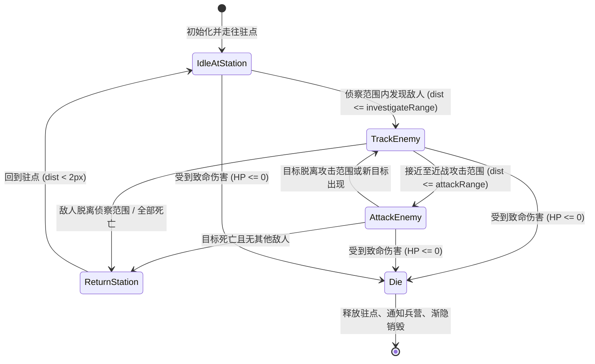

# 战斗系统设计文档 (combat.md)

## 参考项目碰撞/伤害架构

参考: `kingdomRush-gxh1996/assets/scripts/levelScene/`

### 碰撞检测

参考项目使用 Cocos 2.x 的 CollisionManager:
```typescript
// levelScene.ts start()
let manager = cc.director.getCollisionManager();
manager.enabled = true;
```

- 箭矢 groupIndex=1 (Arrow group)
- 怪物 groupIndex=2 (Enemy group)
- 编辑器中配置碰撞矩阵: group 1 ↔ group 2 可碰撞

当前项目使用 **距离检测** 替代物理碰撞（更轻量高效）:
- **单体远程子弹** (`ArrowBullet`, `MagiclanBullet`): 在 `update()` 中每帧检测与所有敌人的距离，距离 $\le \text{HIT\_RADIUS}$ (15px) 判定命中并单体扣血。
- **AOE 范围子弹** (`ArtilleryBullet`): 飞行抵达终点后播放爆炸动画，动画结束时遍历所有存活敌人，检测距爆炸中心的距离 $\le \text{bombRange}$ (50px)，对范围内的所有敌人造成范围伤害。
- **近战士兵** (`KR001Soldier`): 采用侦察范围 (`rangeOfInvestigate`) 与攻击范围 (`rangeOfAttack`) 双层距离检测，拦截并与敌人展开近身格斗。

### 伤害系统

参考项目:
```
arrowBullet.onCollisionEnter(other)
  → if (other.node.group === "Enemy")
      → monster.injure(this.attack)
      → this.destroySelf()
```

当前项目:
```
ArrowBullet.checkHit()
  → Vec3.distance(arrowWorldPos, enemyWorldPos) <= HIT_RADIUS
      → enemy.getComponent(KR001EnemyController).injure(damage)
      → this.node.destroy()
```

---

## 文件结构

### 箭塔攻击 (`arrowtower/`)

```
arrowtower/
├── KR001ArrowTower.ts    塔管理器：加载 prefab，初始化两个 arrower
├── KR001Arrower.ts       弓箭手：独立 update → 检测 → 射击 → 冷却
└── ArrowBullet.ts        箭矢：贝塞尔飞行 + 旋转 + 命中检测 + 伤害
```

### 法师塔 / 炮塔

```
magiclantower/
├── KR001MagiclanTower.ts 自身 update → 检测 → 射击直线法球
└── MagiclanBullet.ts     直线飞行 → 单体命中检测 → 伤害

artillerytower/
├── KR001ArtilleryTower.ts 自身 update → 索敌 → 发射抛物线炮弹
└── ArtilleryBullet.ts     二次贝塞尔抛物线飞行 → bom1~bom10爆炸帧动画 → AOE范围伤害
```

### 兵营与士兵系统 (`barracktower/`)

```
barracktower/
├── KR001BarrackTower.ts   兵营生命周期管理：驻守点管理、即时出兵与阵亡补兵
└── KR001Soldier.ts        士兵 AI：驻点巡逻、索敌追踪、交战拦截 (engage)、近战普攻、受伤死亡
```

### 敌人

```
KR001EnemyController.ts   沿路径移动 + HP管理 + 血条更新 + 受击(injure) + 拦截状态(engage/disengage) + 死亡
```

---

## 士兵战斗系统实现详解 (Soldier Combat System)

参考实现: `kingdomRush-gxh1996/assets/scripts/levelScene/tower/barrack/soldier.ts`

### 1. 状态机与行为决策 (AI State Machine)

`KR001Soldier.ts` 实现了完整的近战战斗决策循环，每帧按如下优先顺序进行状态转移：



### 2. 核心战斗逻辑环节

#### A. 索敌机制 (Investigate)
- **侦察半径**：`SOLDIER_INVESTIGATE_RANGE` (80px)。
- 士兵在 `update()` 中遍历 `EnemyRoot` 下所有存活的敌人节点。
- 筛选处于存活状态且未死亡的敌人，找到距离最近的敌人作为当前优先目标 `_currentTarget`。

#### B. 追踪与朝向翻转 (Track & Orientation)
- 当 `attackRange < distance <= investigateRange` 时，士兵进入追踪状态。
- 计算朝向目标的方向向量并按移动速度 `SOLDIER_SPEED` (40 px/s) 更新本地坐标。
- **精灵翻转**：若目标位于士兵左侧（`dx < 0`），设置 `scale.x = -1`；位于右侧（`dx > 0`）设置 `scale.x = 1`。

#### C. 拦截交战机制 (Melee Engage & Block)
- 当距离进入攻击范围 `SOLDIER_ATTACK_RANGE` (18px) 时触发近战。
- **阻挡敌人前行**：士兵调用 `enemyController.engage()`，使敌人暂停沿地图路径行进，锁定在原地与士兵发生肉搏。
- **攻击前摇与冷却**：
  - 触发攻击后立即进入冷却（`_canAttack = false`，冷却间隔 `SOLDIER_ATTACK_INTERVAL = 1.0s`）。
  - 延时 0.3s（模拟挥刀前摇）后，对敌人造成伤害：`enemyController.injure(SOLDIER_ATTACK_DAMAGE)` (5点伤害)。
- **脱离阻挡**：当士兵阵亡或目标切换时，调用 `enemyController.disengage()`，敌人恢复沿路线继续移动。

#### D. 非战斗状态回驻 (Non-Combat Return)
- 当侦察范围内无有效敌人时，士兵自主进入 `nonComLogic`。
- 计算当前位置与最初分配的驻守点坐标 `_stationPos` 的距离。
- 若尚未抵达驻点（`dist >= 2px`），平滑向驻点移动并在到达后待命。

#### E. 受击、阵亡与兵营回收 (Death & Recycle)
- 受到敌人伤害时执行 `injure(damage)`，扣减当前生命值 `_currentHP`。
- 若生命值归零触发 `die()`：
  - 立即解除与当前敌人的交战阻挡（`disengage`）。
  - 执行 0.5s 渐隐透明度动画（`tween UIOpacity`）。
  - 动画结束后调用 `barrack.releaseSoldier(this)`，通知兵营归还驻点并重新进入 5.0 秒补兵倒计时。

---

## 攻击流程与时序对比

| 塔类型 | 攻击触发 | 弹道/移动轨迹 | 命中/生效方式 | 伤害类型 |
|--------|----------|---------------|---------------|----------|
| **ArrowTower** (箭塔) | 射程内最近敌人 | 二次贝塞尔曲线 + 飞行旋转翻转 | 飞行途中实时距离判定（$\le 15\text{px}$） | 单体 4 点 |
| **MagiclanTower** (法师塔) | 射程内最近敌人 | 直线飞行 | 飞行途中实时距离判定（$\le 15\text{px}$） | 单体 8 点 |
| **ArtilleryTower** (炮塔) | 射程内首个敌人 | 二次贝塞尔高抛抛物线 | 飞抵终点后播放 10 帧爆炸动画，播完后范围伤害 | AOE 范围 6 点 (半径 50px) |
| **BarrackTower** (兵营) | 4名士兵自主索敌 | 沿地面步行追踪 | 近身距离判定（$\le 18\text{px}$）并拦截敌人行进 | 近战 5 点 / 秒 |

---

## 伤害/血条/死亡流程

```
KR001EnemyController.injure(damage)
    → _currentHP -= damage
    → if HP < 0 → HP = 0
    → bloodBar.active = true (首次受击显示)
    → refreshBloodBar(): hpBar.width = fullWidth * (HP / maxHP)
    → if HP <= 0 → die()

KR001EnemyController.die()
    → _isAlive = false, _isMoving = false
    → onDeath callback (通知 spawner)
    → UIOpacity fadeOut 0.5s → destroy
```

---

## 战斗与数值参数表

### 防御设施与单位参数

| 单位 | 攻击力 | 攻击间隔 | 射程/侦察范围 | 飞行/移动速度 | 伤害范围 |
|------|--------|----------|---------------|---------------|----------|
| **ArrowTower** (箭塔) | 4 | 1.5s (双弓箭手) | 150 px | 120 px/s | 单体 |
| **MagiclanTower** (法师塔) | 8 | 1.8s | 170 px | 150 px/s | 单体 |
| **ArtilleryTower** (炮塔) | 6 | 3.0s | 180 px | 80 px/s | AOE (半径 50px) |
| **Soldier** (士兵) | 5 | 1.0s | 80 px (侦察) / 18 px (近战) | 40 px/s | 近战单体 (生命 20) |

### 敌人属性配置 (`gameConfig.json`)

| 怪物编号 | 名称 | 生命值 (HP) | 移动速度 | 攻击力 | 攻击间隔 | 击杀奖励 (金币) |
|----------|------|-------------|----------|--------|----------|-----------------|
| **monster0** | 哥布林 / 杂兵 | 10 | 25 px/s | 10 | 1.0s | 10 |
| **monster1** | 兽人 / 进阶怪物 | 20 | 30 px/s | 12 | 1.0s | 15 |
